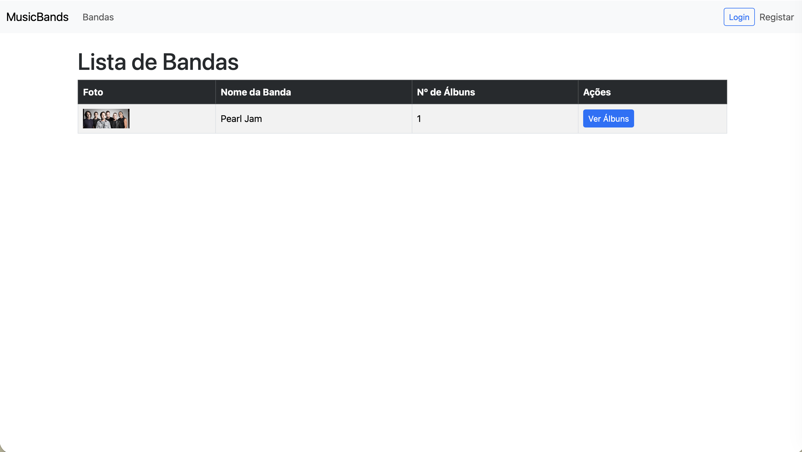
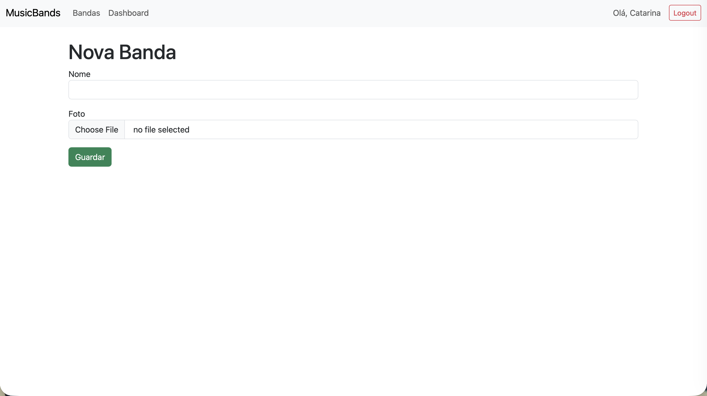
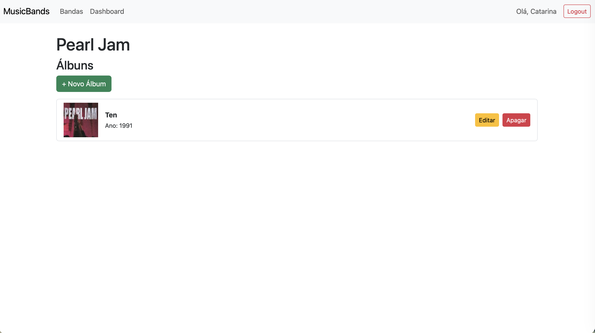
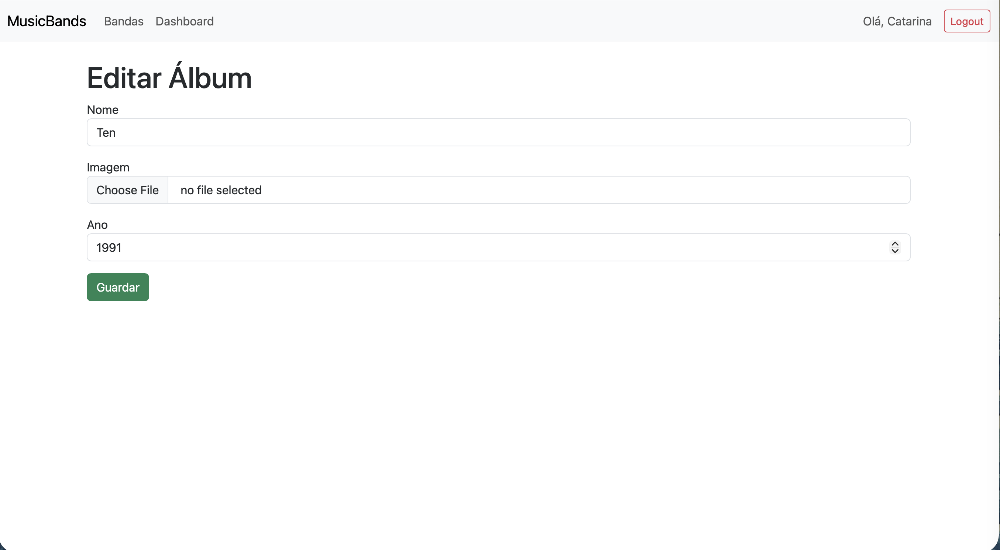
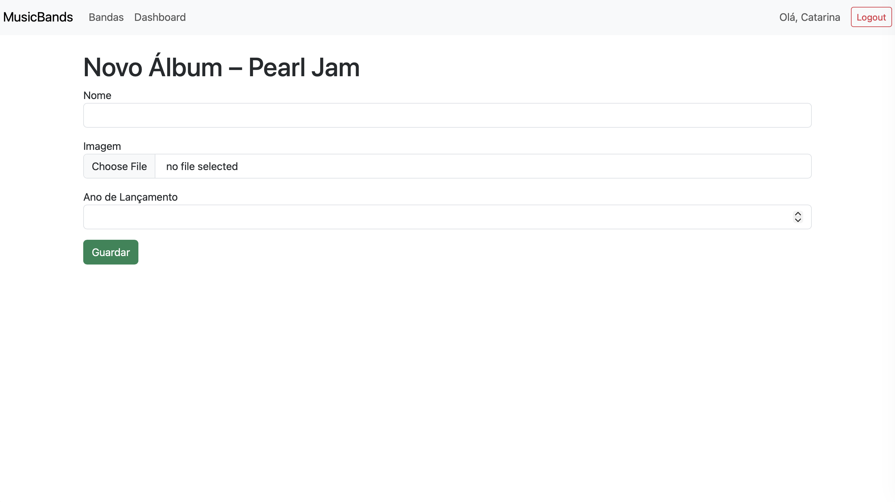

# 🎵 MusicBands

[](https://projecto-final-de-laravel-1.onrender.com)


**MusicBands** is a web application built with **Laravel** for managing and browsing music bands and their albums.

The platform works as a small **music catalogue**, allowing visitors to explore bands and their discographies while providing additional features for authenticated users and administrators.

🔗 **Live Application:**  
https://projecto-final-de-laravel-1.onrender.com

The application organizes content by band, displaying an associated image, the number of albums available, and a dedicated page where the full discography can be viewed.

This project was created as an **academic exercise to demonstrate core Laravel development concepts**, including authentication, role-based access control, and CRUD operations.

---

# 🖼️ Application Preview

<p align="center">
  
  
  
  </p>
<p align="center">
  
  
</p>

---

# ✨ Features

- 🎸 Public listing of music bands  
- 💿 Discography view for each band  
- 🔐 User authentication using **Laravel Fortify**  
- 📊 Dashboard for authenticated users  
- ✏️ Album editing for authenticated users  
- 🛠 Full management of bands and albums for administrators  
- 🖼 Image upload for bands and albums  
- 🔒 Role-based access control using middleware  

---

# 👥 User Roles

### Visitor
Visitors can browse the list of bands and access each band's page to view its albums.

### Authenticated User
Logged-in users can access the dashboard and edit album information.

### Administrator
Administrators have full control over the system and can:

- create bands  
- edit bands  
- delete bands  
- add albums  
- remove albums  

---

# 🛠 Technologies Used

| Technology | Purpose |
|------------|--------|
| **Laravel 12** | Web application framework |
| **PHP 8.2** | Backend language |
| **Laravel Fortify** | Authentication system |
| **Blade** | Templating engine |
| **SQLite** | Database |
| **Vite** | Asset bundling |
| **Bootstrap** | UI styling and responsive layout |

---

# ⚙️ Project Goals

The purpose of this project was to practice **server-side web development using Laravel**, focusing on:

- Routing and controllers  
- MVC architecture  
- Database models and migrations  
- Authentication systems  
- Middleware and access control  
- Form validation  
- CRUD operations  

Additionally, the project demonstrates the separation between **public content and restricted areas**, as well as **user role management** within a Laravel application.

---

# 🚀 Running the Project

### 1. Clone the repository

```bash
git clone https://github.com/your-username/musicbands.git
```

### 2. Install dependencies

```bash
composer install
```

### 3. Configure the environment

```bash
cp .env.example .env
php artisan key:generate
```

### 4. Run migrations

```bash
php artisan migrate
```

### 5. Start the development server

```bash
php artisan serve
```

---

# 👩‍💻 Author

**Catarina Rato**

Academic project developed to explore **Laravel web development, authentication, and role-based access control**.
